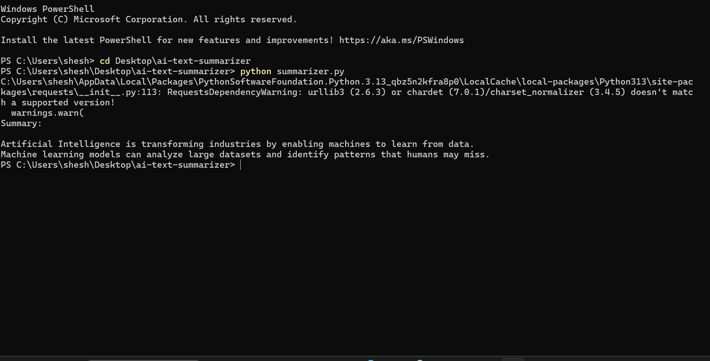

# AI Text Summarizer

This project demonstrates a simple Natural Language Processing (NLP) application that summarizes long text into concise sentences.

## Technologies
- Python
- NLP
- Sumy library

## Use Case
Automatic text summarization can help process large documents, news articles, and medical notes.

## How to Run

pip install sumy

python summarizer.py

## Output Example

# AI Text Summarizer (NLP Project)

This project demonstrates automatic text summarization using Python and Natural Language Processing techniques.

## Technologies Used
- Python
- Sumy
- NLTK
- NumPy

